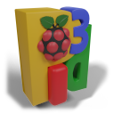

Introduction to pi3d
====================

**pi3d written by Tim Skillman, Paddy Gaunt, Tom Ritchford** Copyright |copy| 2012 - |year|

`RunTests`_ is a video of the standard tests, giving an idea of what
pi3d does, also here's an excellent, self explanatory `YouTube`_ video made by 
Peter Farrell that covers much of the content of this ReadMe.

There's plenty of 3D code flying around for the Raspberry Pi,
but much of it is rather complicated to understand and most of it can sit
under the bonnet!

pi3d is a Python module that aims to greatly simplify writing 3D in Python
whilst giving access to the power of the Raspberry Pi GPU. It enables both
3D and 2D rendering and aims to provide a host of exciting commands to load
in textured/animated models, create fractal landscapes, shaders and much more.

The pi3d module runs on platforms other than the Raspberry Pi (On Windows
using pygame, on linux using the X server directly and on Android using
python-for-android) and runs with python 3 as well as 2.
The OpenGLES2.0 functionality of the Raspberry Pi or Android is used directly
or via mesa or ANGLE on 'big' machines. This makes it generally *faster*
and opens up the world of *shaders* that allow effects such as normal and 
reflection maps, blurring and many others. It has various demos of built-in
shapes, landscapes, model loading, walk-about camera and much more! See the demos
on github.com/pi3d/pi3d_demos and experiment with them ..

If you are reading this document as the ReadMe in the repository then you
can find the full version of the documentation here
http://pi3d.github.com/html/index.html

Demos on github.com/pi3d/pi3d_demos include
===========================================

#.  **ForestWalk.py** Walk about a forest on a landscape generated from a
    bitmap

      .. image:: images/forestwalk_sml.jpg
         :align: right

#.  **Triceratops.py** Large model loading with several
    bitmaps

      .. image:: images/triceratops_sml.jpg

#.  **BuckfastAbbey.py** Explore a model of the beautiful Buckfast Abbey in 
    Buckfastleigh, Devon, England

      .. image:: images/buckfast_sml.jpg
         :align: right

#.  **Earth.py** Demonstrates semi-transparent clouds and hierarchical
    rotations

      .. image:: images/earth_sml.jpg

#.  **Clouds3D.py** Blended sprites in
    perspective view

      .. image:: images/clouds3d_sml.jpg
         :align: right

#.  **Raspberry_Rain.py** Raining Raspberries,  full-screen, over the
    desktop

      .. image:: images/raspberryrain_sml.jpg

#.  **RobotWalkabout.py** Another off-planet example of a basic avatar robot
    drifting about

      .. image:: images/walkabout_sml.jpg
         :align: right

#.  **EnvironmentCube.py** New environment cubes to try out in texture/ecubes -
    some high quality ones!

      .. image:: images/envcube_sml.jpg

#.  **Shapes.py** Demos available shapes and text
    in a 3D context

      .. image:: images/shapes_sml.jpg
         :align: right

#.  **MarsStation.py** Navigate around an abandoned Mars base-station with
    open/shut doors. Implements a new Level-Of-Detail (LOD) feature and TKwindow
    interface

      .. image:: images/marsstation_sml.jpg

#.  **Amazing.py** Can you find yourself around the
    amazing maze?

      .. image:: images/amazing_sml.jpg
         :align: right

#.  **TigerTank.py** Ever played World Of Tanks (WOT)? This tank emulates
    how a WOT tank works. Uses realistic modelling in a TKwindow

      .. image:: images/tigertank_sml.jpg

#.  **Pong.py**  A snazzy 3D version of landscape pinball and pong
    against a Raspberry!

      .. image:: images/pong_sml.jpg
         :align: right

#.  **Blur.py** Simulates giving the camera a focal distance and blurs
    nearer and further objects

      .. image:: images/blur_sml.jpg

#.  **LoadModelObj.py** Loads a model from obj file (quicker) and applies
    a normal map and relfection map

      .. image:: images/teapot_sml.jpg
         :align: right

#.  **Silo.py** Uses the Building class to create a claustrophobic maze
    set in the desert.

      .. image:: images/silo_sml.jpg

#.  **Water.py** A series of wave normal maps are used to animate a surface
    and produce a realistic moving reflection.

      .. image:: images/water_sml.jpg
        :align: right
     
#.  **ClashWalk.py** The graphics processor calculates where the camera can
    or cannot go depending on what is drawn in front of it. Potentially useful
    for first person navigation

#.  **CollisionBalls.py** More bouncing balls across the screen -
    this time  bouncing off each other on the desktop

There are actually at least 50 demos showing a variety of ways of using
pi3d with different levels of complexity.

Files and folders in this repository
====================================

Installation tar.gz on python.pypi.org is c.190kB extracts to 770kB. Total 
zipped download from github is c.600 kB extracts to c.1100kB

#.  **pi3d** The main pi3d module files 517kB
#.  **pyxlib** Library to enable use on general linux machines 209kB
#.  **images** To show in ReadMe on github 325kB
#.  **ReadMe** This file in markup and plain text 27kB
#.  **ChangeLog.txt** Latest changes of pi3d 16kB
#.  **six_mod.py** utilities to help run under python2 and python3 13kB
#.  **misc. others** 10kB

Setup on the Raspberry Pi
=========================

#.  **Qick Start Guide, NB take the time to read the paragraphs below too**

    From 2015 raspbian has the relevant dependencies installed so you just
    need to::

      $ sudo pip3 install pi3d
      $ sudo raspi-config # set gpu_mem=128 - see comments below about graphics driver choice

    *Raspberry Pi v4 and later* **require** the new FAKE KMS (mesa-v3d-VC6..) driver and
    pi3d will rely on having the X11 server running. (X11 is what supports the desktop
    GUI so if you want to run pi3d applications from the command line, without the
    overhead of the desktop you will need to start the X11 server first; see the FAQs
    for more details but along the lines of ``sudo xinit /usr/bin/python3 /home/pi/pi3d_demos/Earth.py -display :0``
    run from /home/pi/pi3d_demos)

    *Older Raspberry Pi versions* will run python applications using pi3d from the
    command line using the 'legacy' drivers but can also run using the new drivers so
    long as X11 server is running (as with RPi4).

    Although you can ``git clone`` pi3d_demos  as in the recipe below this
    will include quite a bit of extra history so it is quicker to download
    the zip from github.com/pi3d/pi3d_demos and extract it on your system,
    either using browser and desktop or wget and unzip.

    Here's a list of commands that have definitely worked on a couple of
    fresh stretch or buster installs. Please take time to check out the paragraphs below
    even if you use either of these quick start recipes... *certainly* if
    have any non-standard aspirations or set-up. The long
    list of dependencies (3rd apt-get line) may take a while to run as well
    as the install Pillow. Both will create hundreds of lines of messages::

      $ cd ~
      $ sudo pip3 install pi3d
      $ sudo raspi-config # set gpu_mem=128 - see graphics driver comment above
      
      ####### download demos in their latest form, quicker #######
      $ wget https://github.com/pi3d/pi3d_demos/archive/master.zip
      $ unzip master.zip
      $ rm master.zip
      $ mv pi3d_demos-master pi3d_demos
      ####### or download the full revision history, slower ######
      $ git clone https://github.com/pi3d/pi3d_demos.git
      
      $ cd ~/pi3d_demos
      $ python3 RunTests.py
      
#.  **Download source, Extract and install**

    There are various possibilities depending on the machine, what's already
    installed and whether you want to work with some of the latest additions.

    If you have pip installed you should be able to open a terminal and
    use ``pip3 install`` as above
        
    (or pip-3.2, pip3.4, pip or whatever see below*) If you don't have pip installed
    you probably should install it as described below under ``Python Imaging``
    as it's the easiest way to install Pillow prior to debian jessie based
    installations.  You can do the equivalent of ``pip install`` manually
    by downloading from https://pypi.python.org/pypi/pi3d and extracting
    the package, then in a terminal::

      $ sudo python3 setup.py install

    This will put the package into the
    relevant location on your device (for instance
    /usr/local/lib/python3.4/dist-packages/) allowing it to be imported
    by your applications.

    If you might want to use features being added in the develop branch (i.e. between
    issues) you will need to download or git clone the latest code from
    https://github.com/tipam/pi3d/ where there is a ``Download ZIP`` link,
    or you can install git (bundled in raspbian) then clone using ``git
    clone https://github.com/tipam/pi3d.git`` this git method will give
    you the option to use the develop branch ``git checkout develop`` and
    update the code by running, from the pi3d directory::

      $ git checkout develop
      $ git pull origin develop
      # the master branch should always be the same as you get with pip3 install

    But to pick up this version of pi3d you will need tell python where to look.
    In the pi3d_demos directory there is a file called demo.py which is imported just
    before pi3d. Basically it just does ``sys.path.insert(1, '/home/pi/pi3d')`` so
    while that line is there your program will use the cloned repository version of pi3d.

#.  **Memory Split setup**

    Although most demos work on 64MB of memory, you are strongly advised to have
    a 128MB of graphics memory split, especially for full-screen 3D graphics.
    In the latest Raspbian build you need to either choose the GUI setup,
    run ``sudo raspi-config`` or edit the config.txt file (in the boot
    directory) and set the variable ``gpu_mem=128`` for 128MB of graphics
    memory.

#.  **Install Python Imaging**

    Before trying any of the demos or pi3d, you need the Python
    Imaging Library as this is needed for importing any graphics used by
    pi3d (though see the minimal example below, which doesn't!). The
    original Imaging library is no longer really maintained and
    doesn't run on python_3. The better equivalent replacement is Pillow.
    
    As of raspbian jessie Pillow is the default imaging library. It's already
    installed on the ``fully featured`` SD image, but it's left off the
    lite image it can be installed using the debian package manager
    (for lite image you also need ``sudo apt-get install python3-numpy``)::

      $ sudo apt-get install python3-pil

    (NB ``python-pil`` will install for python2), but prior
    to jessie you needed to::

      $ sudo apt-get install python3-dev python3-setuptools libjpeg-dev zlib1g-dev libpng12-dev libfreetype6-dev
      $ sudo apt-get install python3-pip
      $ sudo pip3 install Pillow
      ...

    If you miss any of the dependent libraries and need to add them later
    you will have to ``pip3 uninstall`` then re ``pip3 install``

    (on ubuntu and jessie ``pip3`` should work, could be other names,
    google for help or search::
    
      $ sudo find /usr/bin/ -name pip*

    !) If had previously installed the old PIL:
    using ``$ sudo apt-get install python-imaging`` When you later switch
    to Pillow you will need to ``sudo apt-get remove python-imaging`` first.

    To run on Arch linux you will need to install::

      $ pacman -S python
      $ pacman -S python-pillow
      $ pacman -S python-numpy

    python2 has to be explicitly asked for. See `FAQ`_ for a description
    of all the steps to get a quick loading stand-alone pi3d SD card.

Setup on desktop and laptop machines
====================================

  The machine will need to have a gpu that runs OpenGL2+ and obviously
  it will need to have python installed. Setting up in a Linux environment
  is most similar to the procedure for the Raspberry Pi. In fact by far the
  most staightforward route is to make a Raspbian Pixel USB stick following
  the instructions here https://www.raspberrypi.org/blog/pixel-pc-mac/ 
  After that your PC will behave pretty much like the Raspberry Pi and pi3d
  will work after a simple ``sudo pip3 install pi3d`` The USB isn't as fast
  as a hard drive but everything else will run at PC speed. Linux can be set
  up in its own boot partition or in vmware (eg Player which is free, you
  will also need to ``enable 3d acceleration``.)

  For non Pixel linux you will need to install libraries
  that emulate OpenGLES behaviour for the gpu::

    $ sudo apt-get install mesa-utils-extra

  Which should install mesa versions of libEGL.so and libGLESv2.so However
  mesa-utils-extra isn't available on all linux distros but libgles2-mesa
  and libgles2-mesa-dev may provide the required libraries.

  In vmware player on Windows_8.1 I have successfully run pi3d installing lubuntu
  (quickest to set up (1h inc downloads) and run) and ubuntu but debian 7 took a lot
  more setting up and didn't render graphics! Apparently LinuxMint does
  work. One issue running under vmware is that the Mouse class doesn't get
  the correct movements back from /dev/input/mice so you have to use the
  argument ``use_x=True``. This provides coordinates of the pointer position
  relative to the window so limits movement for steering as used in the demos.

  The installation of PIL or Pillow should be the same as for the Raspberry
  Pi above but you are more likely to need to manually install python3-numpy.

  It is likely that pi3d will run on OSX but you might have to compile
  your own mesa libraries (though some seem to be available) Pi3d has
  been run successfully in vmware on mac.

Windows
=======

  In order for pi3d to run on windows you need to install python, Pillow
  and numpy (as above) but pi3d also requires pygame to provide the graphics
  surface and UI, also ANGLE has been used to provide the EGL and GLESv2 emulator
  libraries. These dll files are used by some common applications such as the
  Chrome and Firefox browsers so you may have copies already on your machine but in
  my experience you will need to copy the files to your project location and
  existing copies will be 32 bit versions so won't work with 64 bit python
  - see notes below.

  There are the usual issues of 32v.64bit and python2v3. Initially, while
  testing and developing I used python2.7 and 32 bits, msi installing
  python and pygame and pip installing numpy and Pillow as this seemed to
  be the most straightforward. Subsequently I have installed various different
  version of python both 32 and 64 bit and I have found the best and
  quickest method by far is to install python using the standard windows
  install (If you want the 64 bit version you have to avoid the obvious and look
  at the list of all versions as the default download button will be 32 bit) **then
  install everything else from Christoph Gohlke's site**
  http://www.lfd.uci.edu/~gohlke/pythonlibs/::

    1. Install python from python.org. When running the installer I had
    to select the last option in the list of components to install
    ``..add python.exe to Path`` by selecting the option to install on
    hard drive. Also choose the option to install for all users
    2. http://www.lfd.uci.edu/~gohlke/pythonlibs/#pygame
    3. http://www.lfd.uci.edu/~gohlke/pythonlibs/#numpy
    4. http://www.lfd.uci.edu/~gohlke/pythonlibs/#pillow
    5. each then installed from the command line with
    ``pip install numpy-1.11.1+mkl-cp35-cp35m-win32.whl`` and so on.

  As well as installing the python modules you also need to either find
  several ANGLE dll files on your system or download them from
  http://github.com/paddywwoof/pi3d_windll and copy them into the starting
  directory of the main python file of your project. (If you are running
  64 bit python you will have to use the downloaded versions.) In theory
  you could alter the Windows ``Path`` to point to the location of these
  files but I couldn't get that to work. If you manage to do this then you
  need to edit the path to these files in the pi3d file ``pi3d/constants/__init__.py``
  around lines 87,88. You should be able to find the Chrome and Firefox
  copies of the dlls by starting a search from ``C:\Program Files (x86)\``
  You need to copy the files::

    libglesv2.dll
    libegl.dll
    d3dcompiler_47.dll ## NB the number at the end will increment with later releases
    mozglue.dll ## only for Firefox

  You might only need the first two files if your system has recent drivers
  or GPU. When trying to get 64 bit python working I tried two different
  options when compiling the dll files but they seem to be equivalent and
  I will rationalize them when I get chance.
    
  You can install pi3d using the pip or easy_install methods but you can also
  either clone it with git or download the zip from github and extract
  somewhere sensible on your system. If you do this you will then have to
  add the path to pi3d at the beginning of any files trying to import pi3d::

      import sys
      sys.path.insert(1, "C:/Users/whoever/Documents/GitHub/pi3d")

  For convenience, in pi3d_demos this is included in a file ``demo.py``
  which is imported at the start of each file. I have found it safer to use
  generic forward ``/`` than windows ``\`` or ``\\`` in these paths.

  On windows the pi3d events system (as used by Silo and a couple of other
  demos) does not work as it uses fairly low level linux specific code.

  If you ``mymouse = pi3d.Mouse(restrict=False)`` as in most of the demos
  then the cursor becomes hidden and stuck at the centre of the pygame window.
  This means you can't move or resize the window or close it with the X.
  i.e. you must make sure that you have a keyboard methods of escaping from
  the program (presumably Ctrl+Alt+Del would be a route!).

Android
=======

  Running pi3d on Android is more complicated, but possible.
  see `Android`_

Editing scripts and running
===========================

#.  **Install Geany to run pi3d**

    Although you can use any editor and run the scripts in a terminal using python,
    on the RaspberryPi Geany seems to be the easiest and most compatible
    application to use for creating and running Python scripts. Download
    and install it with::

      $ sudo apt-get install geany xterm

    NB IDLE can't cope with some aspects of the way that most of the pi3d
    demos get key presses using the curses module. There will be an error
    to the effect ``curses.cbreak() returned ERR``

#.  **Optionally, install tk.**

    Some of the demos require the tk graphics toolkit.  To download and install it::

      $ sudo apt-get install tk

#.  **Load and run**

    NB to get all the demos from github and run, in 
    a terminal::
    
      $ git clone https://github.com/pi3d/pi3d_demos.git
      $ cd ~/pi3d_demos
      $ python3 Minimal.py
      
    or load any of the demos into Geany and run (using the cogs icon). As a minimum,
    scripts need these elements in order to use the pi3d library::

      import pi3d
      DISPLAY = pi3d.Display.create()
      ball = pi3d.Sphere(z=5.0)
      while DISPLAY.loop_running():
        ball.draw()

    (Which should work even without python imaging) But.. a real application
    will need other code to actually do something, for instance to get user
    input in order to stop the program!

A Very Brief Explanation
========================

The whole idea of pi3d is that you don't have to get involved in too many of
the nuts and bolts of how the OpenGL graphics processor works however it might
help to get an overview of the layout of pi3d. More detailed explanations can
be found in the documentation of each of the modules. Read `FAQ`_ before
you try anything ambitious or if anything goes wrong, obviously. There is a
`3D Graphics Explanation`_ where I try to explain in some more detail what
is going on.

  **Display** The `Display`_ class is the core and is used to hold screen dimension information,
  to initiate the graphics functionality and for 'central' information, such as timing,
  for the animation. There needs to be an instance of `Display`_ in existence
  before some of the other objects are created so it's a good idea to create one
  first job.
  
  **Shape** `All objects to be drawn by pi3d`_ inherit from the `Shape`_ class which holds
  details of position, rotation, scale as well as specific data needed for
  drawing the shape. Each `Shape`_ contains an array of `Buffer`_ objects; normally
  only containing one but there could be more in complicated models created
  with external 3D applications. 
  
  **Buffer** The `Buffer`_ objects contain the arrays of values representing vertices,
  normals, faces and texture coordinates in a form that can be quickly read by
  the graphics processor. Each Buffer_ object within a `Shape`_ can be textured
  using a different image or shade (RGB) value and, if needed, a different `Shader`_
  
  **Shader** The `Shader`_ class is used to compile *very fast* programs that are run on
  the graphics processor. They have two parts: *Vertex Shaders* that do calculation
  for each of the vertices of the `Buffer`_ and *Fragment Shaders* applied to
  each pixel. In pi3d we have kept the shaders out of the main python files
  and divided them using the two extensions .vs and .fs The shader language
  is C like, very clever indeed, but rather hard to fathom out.
  
  **Camera** In order to draw a `Shape`_ on the `Display`_ the `Shader`_ needs to be passed the
  vertex information in the Buffers and needs know how the `Shape`_ has been moved.
  But it also needs to know how the `Camera`_ has moved. The `Camera`_ class generally
  has just one instance and if you do not create one explicitly then `Display`_ will
  generate a default one when you first try to draw something. The `Camera`_
  has position and rotation information similar to Shapes but also information
  to create the view, such as how wide-angle or telephoto the lens is.
  
  **Texture** The `Texture`_ objects are used to load images from file into a form that
  can be passed to the `Shader`_ to draw onto a surface. They can also be applied as
  normal maps to give much finer local detail or as reflection maps - a much
  faster way to make surfaces look shiny than ray tracing.
  
  **Light** To produce a 3D appearance most of the Shaders use directional lighting and
  if you draw a `Shape`_ without creating a `Light`_ a default instance will be
  created by the `Display`_. The `Light`_ has properties defining the direction,
  the colour (and strength i.e. RGB values) and ambient colour (and strength).

  Although drawing a Shape requires references to ``Shader``, ``Light`` and ``Camera``
  objects, default instances will be created automatically if they are not
  specified (as in the example minimal code above)

  When you look through the demos you will see one or two things that may
  not be immediately obvious. All the demos start with::
  
    #!/usr/bin/python
    from __future__ import absolute_import, division, print_function, unicode_literals

  Although these lines can often be left out, the first tells any process running the file
  as a script that it's python and the second is basically to help the transition
  of this code to run using python 3::
  
    import demo

  Allows the demo files to be put in a different location from pi3d but still run. If you install
  pi3d using pip or ``python setup.py install`` then you can take this out::
  
    import pi3d

  Is an alternative to importing just what you need i.e.::
  
    from pi3d.constants import *
    from pi3d import Display
    from pi3d.Texture import Texture
    from pi3d.Keyboard import Keyboard
    from pi3d.Light import Light
    from pi3d.Shader import Shader
    from pi3d.util.String import String
    ...
    from pi3d.shape.Sphere import Sphere
    from pi3d.shape.Sprite import Sprite

  If you import the whole lot using ``import pi3d`` then you need to prefix classes
  and functions with ``pi3d.`` A third way to import the modules would be to use
  ``from pi3d import *`` this saves having to use the ``pi3d.`` prefix but
  is **much harder to debug** if there is a name conflict.
  
.. _Display: pi3d.html#pi3d.Display.Display
.. _Shape: pi3d.html#pi3d.Shape.Shape
.. _Buffer: pi3d.html#pi3d.Buffer.Buffer
.. _Shader: pi3d.html#pi3d.Shader.Shader
.. _Camera: pi3d.html#pi3d.Camera.Camera
.. _Texture: pi3d.html#pi3d.Texture.Texture
.. _Light: pi3d.html#pi3d.Light.Light
.. _`All objects to be drawn by pi3d`: pi3d.shape.html#module-pi3d.shape.Cone
.. _`FAQ`: FAQ.html
.. _`3D Graphics Explanation`: GPUexplain.html
.. _Android: AndroidUse.html
.. _YouTube: https://youtu.be/gXTU6x8dQJw
.. _RunTests: https://youtu.be/TGGmnG_hrz4
.. |year| date:: %Y
.. |copy| unicode:: 0xA9 .. copyright sign

Documentation
=============

Please note that pi3d functions may change significantly during its development.

Bug reports, comments, feature requests and fixes are most welcome!

Please email on pi3d@googlegroups.com or contact us through the Raspberry Pi forums
or on http://pi3d.github.com/html/index.html

Acknowledgements
================

pi3d started with code based on Peter de Rivaz 'pyopengles'
(https://github.com/peterderivaz/pyopengles) with some tweaking from Jon Macey's
code (jonmacey.blogspot.co.uk/2012/06/).

Many Thanks, especially to Peter de Rivaz, Jon Macey, Richar Urwin, Peter Hess,
David Wallin, Avishay Orpaz (avishorp), Guenter Kreidl, Benjamin Denozière,
Matthew Coleman, Piotr Bednarski, @swehner and others who have contributed 
to pi3d - keep up the good work!

**PLEASE READ LICENSING AND COPYRIGHT NOTICES ESPECIALLY IF USING FOR COMMERCIAL PURPOSES**

