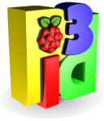

Introduction to Pi3D
====================

**Pi3D written by Tim Skillman, Paddy Gaunt, Tom Ritchford Copyright (c) 2013**

There's plenty of 3D code flying around at the moment for the Raspberry Pi,
but much of it is rather complicated to understand and most of it can sit
under the bonnet!

pi3d is a Python module that aims to greatly simplify writing 3D in Python
whilst giving access to the power of the Raspberry Pi GPU. It enables both
3D and 2D rendering and aims to provide a host of exciting commands to load
in textured/animated models, create fractal landscapes, shaders and much more.

This is the fourth release of the pi3d module which now uses the OpenGLES2.0
functionality of the Raspberry Pi directly. This makes it generally *faster*
and opens up the world of *shaders* that allow effects such as normal and 
reflection maps, blurring and many others. It has various demos of built-in
shapes, landscapes, model loading, walk-about camera and much more! See the demos
included with this code and experiment with them ..

If you are reading this document as the ReadMe in the repository then you
can find the full version of the documentation here
http://pi3d.github.com/html/index.html

Demo's included with Pi3D
=========================

#.  **ForestWalk.py** Walk about a forest on a landscape generated from a
    bitmap
      .. image:: images/forestwalk_sml.png
         :align: right

#.  **Triceratops.py** Large model loading with several
    bitmaps
      .. image:: images/triceratops_sml.png

#.  **BuckfastAbbey.py** Explore a model of the beautiful Buckfast Abbey in 
    Buckfastleigh, Devon, England
      .. image:: images/buckfast_sml.png
         :align: right

#.  **Earth.py** Demonstrates semi-transparent clouds and hierarchical
    rotations
      .. image:: images/earth_sml.png

#.  **Clouds3D.py** Blended sprites in
    perspective view
      .. image:: images/clouds3d_sml.png
         :align: right

#.  **Raspberry_Rain.py** Raining Raspberries,  full-screen, over the
    desktop
      .. image:: images/raspberryrain_sml.png

#.  **RobotWalkabout.py** Another off-planet example of a basic avatar robot
    drifting about
      .. image:: images/walkabout_sml.png
         :align: right

#.  **EnvironmentCube.py** New environment cubes to try out in texture/ecubes -
    some high quality ones!
      .. image:: images/envcube_sml.png

#.  **Shapes.py** Demos available shapes and text
    in a 3D context
      .. image:: images/shapes_sml.png
         :align: right

#.  **MarsStation.py** Navigate around an abandoned Mars base-station with
    open/shut doors. Implements a new Level-Of-Detail (LOD) feature and TKwindow
    interface
      .. image:: images/marsstation_sml.png

#.  **Amazing.py** Can you find yourself around the
    amazing maze?
      .. image:: images/amazing_sml.png
         :align: right

#.  **TigerTank.py** Ever played World Of Tanks (WOT)? This tank emulates
    how a WOT tank works. Uses realistic modelling in a TKwindow
      .. image:: images/tigertank_sml.png

#.  **Pong.py**  A snazzy 3D version of landscape pinball and pong
    against a Raspberry!
      .. image:: images/pong_sml.png
         :align: right

#.  **Blur.py** Simulates giving the camera a focal distance and blurs
    nearer and further objects
      .. image:: images/blur_sml.png

#.  **LoadModelObj.py** Loads a model from obj file (quicker) and applies
    a normal map and relfection map
      .. image:: images/teapot_sml.png
         :align: right

#.  **Silo.py** Uses the Building class to create a claustrophobic maze
    set in the desert.
      .. image:: images/silo_sml.png

#.  **Water.py** A series of wave normal maps are used to animate a surface
    and produce a realistic moving reflection.
      .. image:: images/water_sml.png
        :align: right
     
#.  **ClashWalk.py** The graphics processor calculates where the camera can
    or cannot go depending on what is drawn in front of it. Potentially useful
    for first person navigation

#.  **CollisionBalls.py** More bouncing balls across the screen -
    this time  bouncing off each other on the desktop

Files and folders in this repository
====================================

Total zipped download from github c. 24 MB

#.  **pi3d** The main pi3d module files 540 kB
#.  **shaders** Shader files used by the pi3d module 33 kB
#.  **echomesh** Utility functions 14kB
#.  **textures** Various textures to play with 13 MB
#.  **models** Demo obj and egg models 26 MB
#.  **fonts** ttf and Bitmap fonts that can be using for drawing text see in
    /usr/share/fonts/truetype for others, or look online. 1.0 MB
#.  **demos** Source code of the demos included 96 kB
#.  **screenshots** Example screenshots of the demos included 860 kB
#.  **documentation** Where this documentation lives 5.7 MB
#.  **ChangeLog.txt** Latest changes of Pi3D
#.  **ReadMe.rst** This file

Setup on the Raspberry Pi
=========================

#.  **Memory Split setup**

    Although most demos work on 64MB of memory, you are strongly advised to have
    a 128MB of graphics memory split, especially for full-screen 3D graphics.
    In the latest Raspbian build you need to either run ``sudo raspi-config``
    or edit the config.txt file (in the boot directory) and set the variable
    ``gpu_mem=128`` for 128MB of graphics memory.

#.  **Install Python Imaging**

    Before trying any of the demos or Pi3D, you must download the Python Imaging
    Library as this is needed for importing any graphics used by Pi3. To install
    on the terminal, type::

      sudo apt-get install python-imaging

#.  **Install Geany to run Pi3D**

    Although you can use any editor and run the scripts in a terminal using python,
    Geany is by far the easiest and most compatible application to use for creating
    and running Python scripts. Download and install it with::

      sudo apt-get install geany xterm

#.  **Optionally, install tk.**

    Some of the demos require the tk graphics toolkit.  To download and install it::

      sudo apt-get install tk

#.  **Load and run**

    Load any of the demos into Geany and run (using the cogs icon). As a minimum,
    scripts need these elements in order to use the pi3d library::

      import pi3d
      DISPLAY = pi3d.Display.create(w=128, h=128)
      shader = pi3d.Shader("shaders/2d_flat")
      sprite = pi3d.ImageSprite("textures/PATRN.PNG", shader)
      while DISPLAY.loop_running():
        sprite.draw()

    But.. a real application will need other code to actually do something, for
    instance to get user input in order to stop the program!

A Very Brief Explanation
========================

The whole idea of Pi3d is that you don't have to get involved in too many of
the nuts and bolts of how the OpenGL graphics processor works however it might
help to get an overview of the layout of Pi3d. More detailed explanations can
be found in the documentation of each of the modules.

  **Display** The `Display`_ class is the core and is used to hold screen dimension information,
  to initiate the graphics functionality and for 'central' information, such as timing,
  for the animation. There needs to be an instance of `Display`_ in existence
  before some of the other objects are created so it's a good idea to create one
  first job.
  
  **Shape** `All objects to be drawn by Pi3d`_ inherit from the `Shape`_ class which holds
  details of position, rotation, scale as well as specific data needed for
  drawing the shape. Each `Shape`_ contains an array of `Buffer`_ objects; normally
  only containing one but there could be more in complicated models created
  with external 3D applications. 
  
  **Buffer** The `Buffer`_ objects contain the arrays of values representing vertices,
  normals, faces and texture coordinates in a form that can be quickly read by
  the graphics processor. Each Buffer_ object within a `Shape`_ can be textured
  using a different image or shade (RGB) value and, if needed, a different `Shader`_
  
  **Shader** The `Shader`_ class is used to compile *very fast* programs that are run on
  the graphics processor. They have two parts: *Vertex Shaders* that do calculation
  for each of the vertices of the `Buffer`_ and *Fragment Shaders* applied to
  each pixel. In Pi3d we have kept the shaders out of the main python files
  and divided them using the two extensions .vs and .fs The shader language
  is C like, very clever indeed, but rather hard to fathom out.
  
  **Camera** In order to draw a `Shape`_ on the `Display`_ the `Shader`_ needs to be passed the
  vertex information in the Buffers and needs know how the `Shape`_ has been moved.
  But it also needs to know how the `Camera`_ has moved. The `Camera`_ class generally
  has just one instance and if you do not create one explicitly then `Display`_ will
  generate a default one when you first try to draw something. The `Camera`_
  has position and rotation information similar to Shapes but also information
  to create the view, such as how wide-angle or telephoto the lens is.
  
  **Texture** The `Texture`_ objects are used to load images from file into a form that
  can be passed to the `Shader`_ to draw onto a surface. They can also be applied as
  normal maps to give much finer local detail or as reflection maps - a much
  faster way to make surfaces look shiny than ray tracing.
  
  **Light** To produce a 3D appearance most of the Shaders use directional lighting and
  if you draw a `Shape`_ without creating a `Light`_ a default instance will be
  created by the `Display`_. The `Light`_ has properties defining the direction,
  the colour (and strength i.e. RGB values) and ambient colour (and strength).

  When you look through the demos you will see one or two things that may
  not be immediately obvious. All the demos start with::
  
    #!/usr/bin/python
    from __future__ import absolute_import, division, print_function, unicode_literals

  Although these lines can often be left out, the first tells any process running the file
  as a script that it's python and the second is basically to help the transition
  of this code to run using python 3::
  
    import demo

  Allows the demo files to be put in a subdirectory but still run. If you write
  a program in the top directory then you will need to take this out::
  
    import pi3d

  Is an alternative to importing just what you need i.e.::
  
    from pi3d.constants import *
    from pi3d import Display
    from pi3d.Texture import Texture
    from pi3d.Keyboard import Keyboard
    from pi3d.Light import Light
    from pi3d.Shader import Shader
    from pi3d.util.String import String
    ...
    from pi3d.shape.Sphere import Sphere
    from pi3d.shape.Sprite import Sprite

  If you import the whole lot using ``import pi3d`` then you need to prefix classes
  and functions with ``pi3d.`` And you are loading a large number of variable names
  which might cause a conflict, isn't as explicit and is less tidy (in the non-
  superficial sense)! A third way to import the modules would be to use
  ``from pi3d import *`` this saves having to use the ``pi3d.`` prefix but
  is **much harder to debug** if there is a name conflict.
  
.. _Display: pi3d.html#pi3d.Display.Display
.. _Shape: pi3d.html#pi3d.Shape.Shape
.. _Buffer: pi3d.html#pi3d.Buffer.Buffer
.. _Shader: pi3d.html#pi3d.Shader.Shader
.. _Camera: pi3d.html#pi3d.Camera.Camera
.. _Texture: pi3d.html#pi3d.Texture.Texture
.. _Light: pi3d.html#pi3d.Light.Light
.. _`All objects to be drawn by Pi3d`: pi3d.shape.html#module-pi3d.shape.Cone

Documentation
=============

Please note that Pi3D functions may change significantly during it's development.

Bug reports, comments, feature requests and fixes are most welcome!

Please email on pi3d@googlegroups.com or contact us through the Raspberry Pi forums
or on http://pi3d.github.com/html/index.html

Acknowledgements
================

Pi3D started with code based on Peter de Rivaz 'pyopengles'
(https://github.com/peterderivaz/pyopengles) with some tweaking from Jon Macey's
code (jonmacey.blogspot.co.uk/2012/06/).

Many Thanks, especially to Peter de Rivaz, Jon Macey, Richar Urwin, Peter Hess,
David Wallin and others who have contributed to Pi3D - keep up the good work!

**PLEASE READ LICENSING AND COPYRIGHT NOTICES ESPECIALLY IF USING FOR COMMERCIAL PURPOSES**

